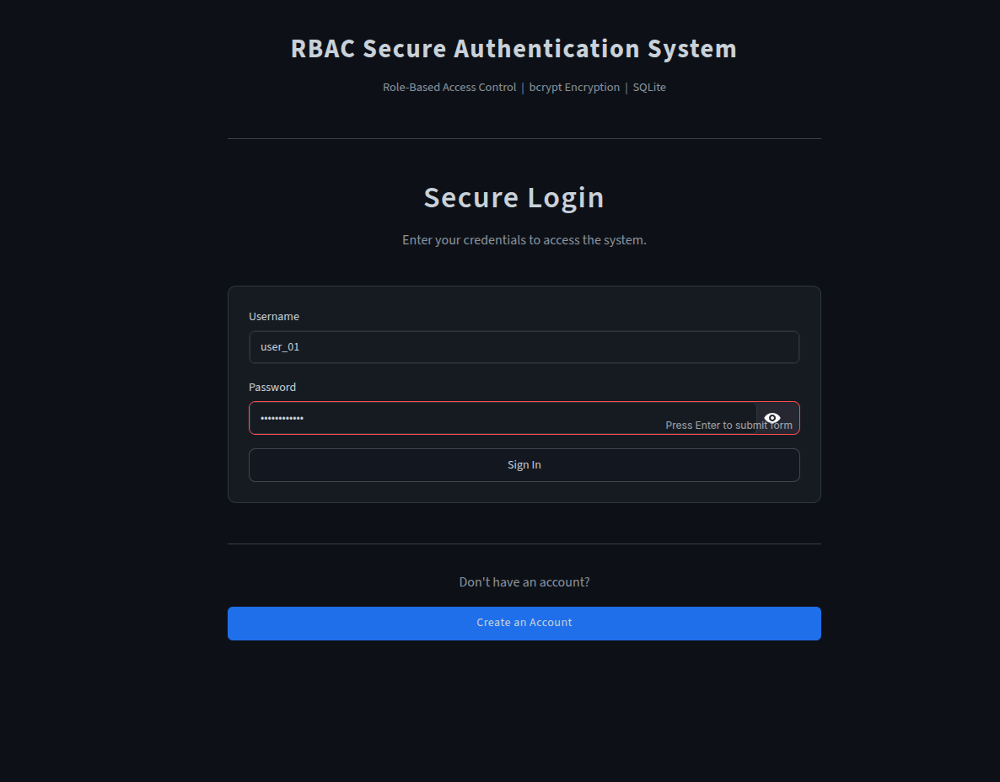
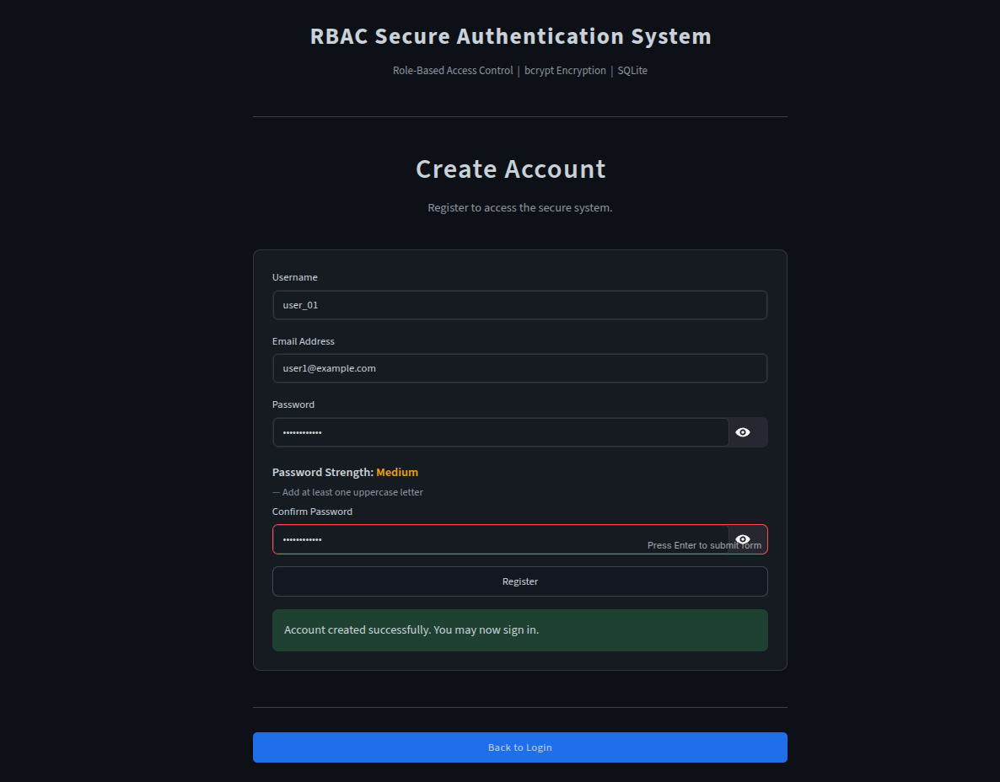
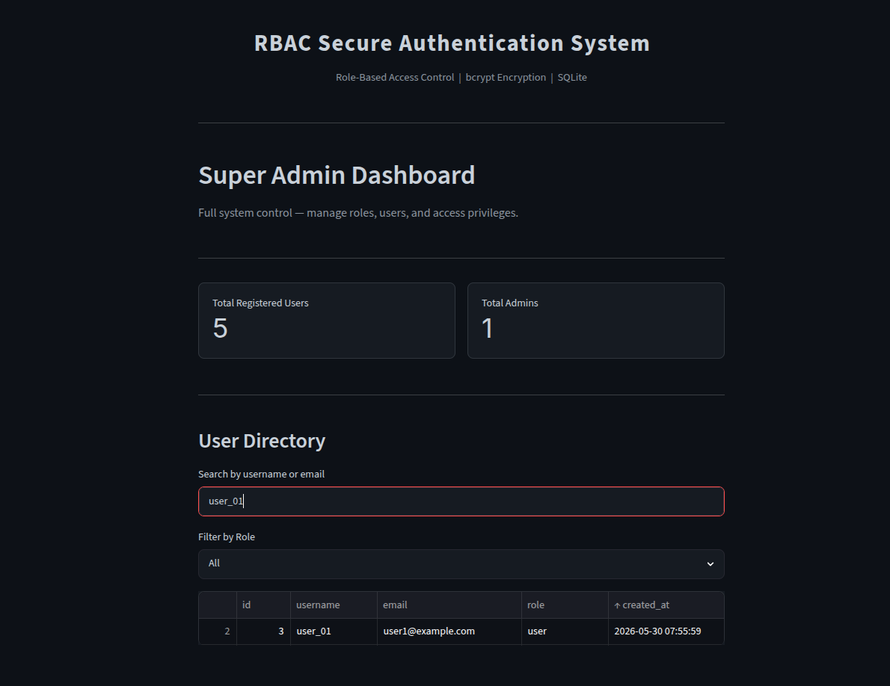
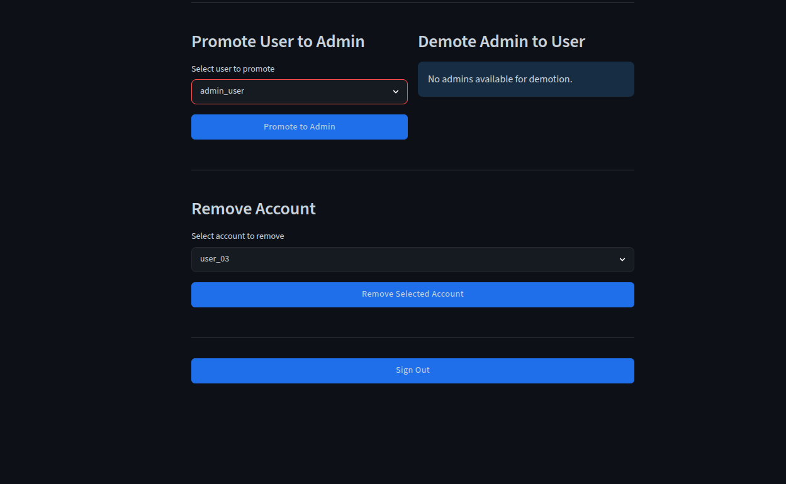
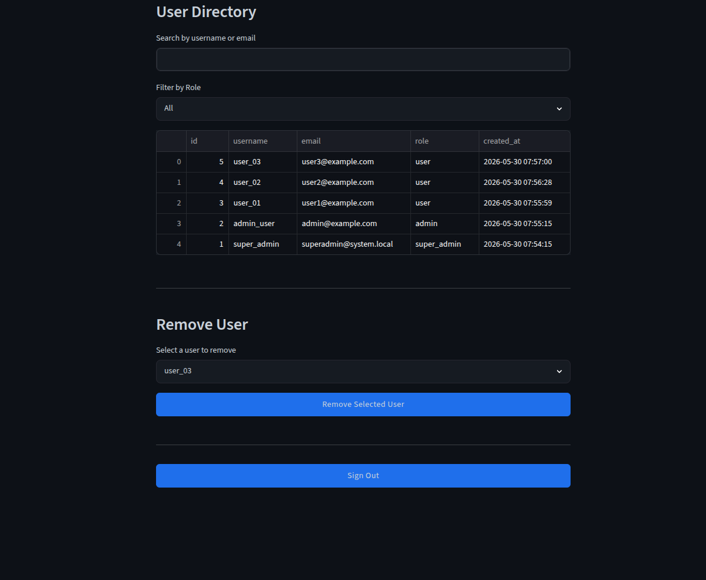
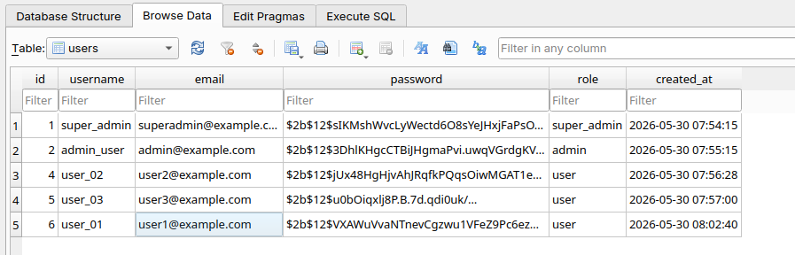

# 🔐 Secure RBAC Authentication System

A secure Role-Based Access Control (RBAC) authentication system built with **Python, Streamlit, SQLite, and bcrypt**.

This project demonstrates secure user authentication, password hashing, role-based authorization, account management, and administrative controls through separate dashboards for Users, Admins, and Super Admins.

---

## 🚀 Features

### Authentication
- User Registration
- Secure Login System
- Password Confirmation Validation
- Password Strength Checking
- bcrypt Password Hashing
- Session-Based Authentication

### Role-Based Access Control (RBAC)
- User Role
- Admin Role
- Super Admin Role
- Protected Dashboard Access
- Permission-Based Functionality

### Administration
- User Search
- User Filtering
- User Promotion
- User Demotion
- User Deletion
- User Database Management

### Database
- SQLite Database Storage
- Unique Username Validation
- Unique Email Validation
- Secure Password Storage
- Account Creation Timestamps

---

# 🛠 Technology Stack

| Technology | Purpose |
|------------|----------|
| Python | Backend Logic |
| Streamlit | User Interface |
| SQLite | Database |
| bcrypt | Password Hashing |
| Pandas | Data Handling |

---

# 📂 Project Structure

```text
secure-rbac-authentication-system/
│
├── app.py
├── requirements.txt
├── README.md
│
└── screenshots/
    ├── 01-login.png
    ├── 02-registration.png
    ├── 03-user-dashboard.png
    ├── 04-admin-dashboard.png
    ├── 05-super-admin-search.png
    ├── 06-role-management.png
    ├── 07-user-deletion.png
    └── 08-database.png
```

---

# 📸 Project Screenshots

## 1. Secure Login Interface

The login page verifies user credentials and securely authenticates registered users before granting access to the system.



---

## 2. User Registration with Password Validation

New users can create accounts using unique usernames and email addresses. Password strength is validated before registration, and passwords are securely hashed using bcrypt.



---

## 3. User Dashboard

Standard users can access their personal dashboard and view their account information while remaining restricted from administrative functions.


---

## 4. Admin Dashboard

Administrators can review user accounts, monitor registered users, search records, and access management features unavailable to standard users.


---

## 5. Super Admin Dashboard with User Search

The Super Admin has complete system visibility and can search user records, review account information, and manage access privileges across the platform.



---

## 6. Role Promotion and Demotion Controls

The Super Admin can promote standard users to administrators and demote administrators back to regular users through role management controls.



---

## 7. User Deletion Management

Administrative users can remove selected accounts from the system while maintaining role-based restrictions and access controls.



---

## 8. SQLite User Database with RBAC Roles

User credentials, account metadata, timestamps, and role assignments are securely stored within a SQLite database.



---

# 🔒 Security Features

- bcrypt Password Hashing
- Role-Based Authorization
- Session Authentication
- Unique Username Enforcement
- Unique Email Enforcement
- Secure Password Storage
- Permission-Based Dashboard Access
- Account Management Controls

---

# ⚙️ Installation

Clone the repository:

```bash
git clone https://github.com/irfanahmed0019/secure-rbac-authentication-system.git
```

Move into the project directory:

```bash
cd secure-rbac-authentication-system
```

Install dependencies:

```bash
pip install -r requirements.txt
```

Run the application:

```bash
streamlit run app.py
```

---

# 📋 Requirements

```text
streamlit
bcrypt
pandas
```

---

# 🎯 Learning Outcomes

This project demonstrates practical experience with:

- Authentication Systems
- Authorization & RBAC
- Secure Password Storage
- SQLite Database Design
- User Management Systems
- Python Application Development
- Streamlit Dashboard Development
- Security Best Practices

---

# 👨‍💻 Author

**Irfan Ahammad**

Aspiring AI Engineer | Python Developer | Cybersecurity & AI Enthusiast

GitHub:
https://github.com/irfanahmed0019
