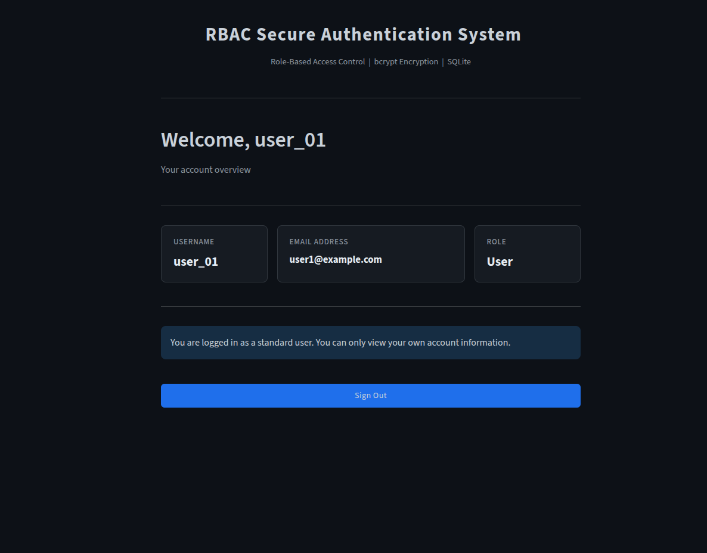
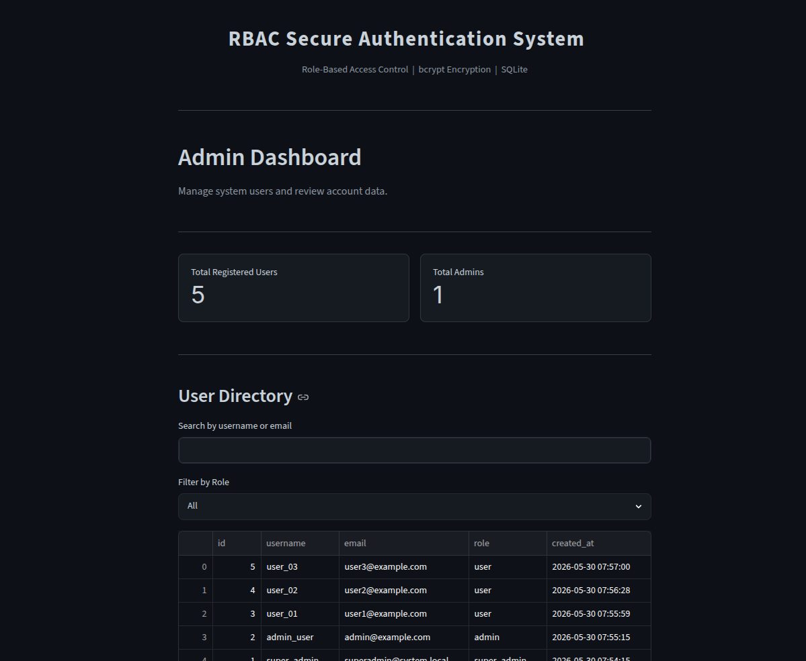

# 🔐 Secure RBAC Authentication System

A secure Role-Based Access Control (RBAC) authentication system built using Python, Streamlit, SQLite, and bcrypt. This project demonstrates secure user authentication, password encryption, role-based authorization, and administrative user management through an interactive web interface.

---

## 📖 Overview

Managing user access is a critical part of modern applications. This project implements a complete authentication and authorization workflow where users are assigned different roles and permissions.

The system supports three access levels:

- **User** – Can view only their own account information.
- **Admin** – Can manage users and monitor account data.
- **Super Admin** – Has full system control, including role management and account administration.

Passwords are securely hashed using **bcrypt**, and all user information is stored in an **SQLite** database.

---

## ✨ Features

### Authentication & Security
- Secure user registration
- Secure login system
- Password hashing using bcrypt
- Password strength validation
- Session-based authentication
- Protected role-based access

### User Features
- Personal dashboard
- View account information
- Secure sign out

### Admin Features
- View registered users
- Search users by username or email
- Filter users by role
- Remove user accounts

### Super Admin Features
- View all users
- Promote users to Admin
- Demote Admins to Users
- Remove accounts
- Full RBAC management

### Database Features
- SQLite database integration
- Unique usernames and emails
- Role-based user records
- Automatic account creation timestamps

---

## 🛠️ Technology Stack

| Technology | Purpose |
|------------|----------|
| Python | Backend Logic |
| Streamlit | Web Interface |
| SQLite | Database |
| bcrypt | Password Hashing |
| Pandas | Data Management |

---

## 📂 Project Structure

```text
secure-rbac-authentication-system/
│
├── screenshots/
│   ├── 01-login-interface.png
│   ├── 02-user-registration.png
│   ├── 03-user-dashboard.png
│   ├── 04-admin-dashboard.png
│   ├── 05-super-admin-dashboard-with-search.png
│   ├── 06-role-promotion-and-demotion.png
│   ├── 07-user-removal-management.png
│   └── 08-sqlite-user-database.png
│
├── app.py
├── requirements.txt
└── README.md
```

---

## 🚀 Installation

### Clone Repository

```bash
git clone https://github.com/yourusername/secure-rbac-authentication-system.git

cd secure-rbac-authentication-system
```

### Install Dependencies

```bash
pip install -r requirements.txt
```

### Run Application

```bash
streamlit run app.py
```

---

# 📸 Application Screenshots

## 1. Secure Login Interface

The login page verifies user credentials and securely authenticates registered users before granting access to the system.


---

## 2. User Registration with Password Validation

New users can create accounts using unique usernames and email addresses. Password strength is validated before registration, and passwords are securely hashed using bcrypt.


---

## 3. User Dashboard

Standard users can access their personal dashboard and view their account information while remaining restricted from administrative functions.



---

## 4. Admin Dashboard

Administrators can review user accounts, monitor system users, and access management features unavailable to standard users.



---

## 5. Super Admin Dashboard with User Search

The Super Admin has complete system visibility and can search user records, review account information, and manage access privileges.


---

## 6. Role Promotion and Demotion Controls

The system allows the Super Admin to promote users to administrator roles or demote administrators back to standard user status.


---

## 7. User Removal Management

Authorized administrators can remove selected user accounts from the system through a controlled management interface.


---

## 8. SQLite User Database with RBAC Roles

User information is stored in an SQLite database with encrypted passwords, assigned roles, and account creation timestamps.


---

## 🔒 Security Implementation

This project follows several security practices:

- Password hashing using bcrypt
- No plaintext password storage
- Unique username enforcement
- Unique email enforcement
- Role-based authorization
- Session-controlled access
- Administrative privilege separation

---

## 🎯 Learning Outcomes

This project helped demonstrate practical understanding of:

- Authentication Systems
- Authorization and RBAC
- Database Design
- Password Security
- User Management Systems
- Secure Application Development
- Python Backend Development
- Streamlit Application Development

---

## 🔮 Future Improvements

Potential enhancements include:

- Multi-Factor Authentication (MFA)
- Password Reset Functionality
- Email Verification
- PostgreSQL Integration
- Activity Logging
- Audit Trails
- Account Lockout Protection
- JWT-Based Authentication
- Docker Deployment

---

## 👨‍💻 Author

**Irfan Ahammad**

Computer Engineering Student

GitHub: https://github.com/irfanahmed0019

---

## ⭐ Support

If you found this project useful, consider giving the repository a star.
